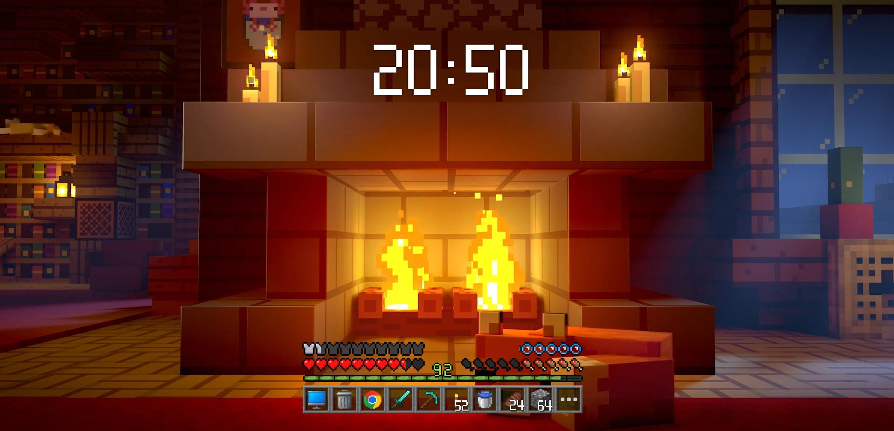

# DMeloper's Block HUD

[English](README.md) | 한국어



DMeloper's Block HUD는 Minecraft 스타일의 인벤토리와 핫바 UI에서 영감을 받은 비공식 Windows용 Rainmeter 스킨입니다.

이 스킨은 블록형 HUD 구성을 선호하는 사용자를 위해 제작되었으며, 핫바, 인벤토리 패널, 시스템 인디케이터, 시계, 설정 창, 사용자 슬롯 및 이미지 편집을 위한 내장 에디터를 포함합니다.

Rainmeter나 스킨 설치에 익숙하지 않은 사용자는 아래 스킨 노션 페이지에서 자세한 설치 및 사용 방법을 확인할 수 있습니다.

[스킨 노션 페이지](https://www.notion.so/DMeloper-s-Block-HUD-2f12dc0bb4ae803a8643f3eb1601ed5d?pvs=21)

## 다운로드

최신 버전은 GitHub Releases 페이지에서 내려받을 수 있습니다.

https://github.com/d-meloper/dmelopers-block-hud/releases/latest

다운로드하기 전에 release notes를 확인해 주세요. release notes에는 사용할 수 있는 variant asset과 공개된 asset의 SHA256 checksum이 적혀 있습니다. Korea 또는 Global variant가 일시적으로 제공되지 않을 수 있으며, 이 경우 해당 asset은 checksum 줄 없이 unavailable로 표시됩니다.

GitHub에서 직접 설치하려는 경우에는 반드시 `.rmskin` 파일을 사용하세요. `.zip` 파일은 스킨 내부의 버전 관리자 및 업데이터에서 사용하는 패키지이며, 일반적인 수동 설치용으로는 권장하지 않습니다.

한국어 사용자는 `DMelopers-Block-HUD_Korea.rmskin`을 내려받는 것을 권장합니다. 영어 또는 글로벌 환경 사용자는 `DMelopers-Block-HUD_Global.rmskin`을 사용하세요.

| 패키지 | 권장 대상 | 파일 |
| --- | --- | --- |
| Korea RMSKIN | 한국어 사용자, 직접 설치 | `DMelopers-Block-HUD_Korea.rmskin` |
| Global RMSKIN | 영어/글로벌 사용자, 직접 설치 | `DMelopers-Block-HUD_Global.rmskin` |
| Korea ZIP | Korea 버전 관리자/업데이터 전용 | `DMelopers-Block-HUD_Korea.zip` |
| Global ZIP | Global 버전 관리자/업데이터 전용 | `DMelopers-Block-HUD_Global.zip` |

Korea와 Global은 모두 같은 Rainmeter 스킨 폴더에 설치됩니다.

```text
DMeloper's Block HUD
```

두 variant는 나란히 공존하도록 설계되지 않았습니다. 한 variant 위에 다른 variant를 설치하면 기존 스킨 폴더가 덮어써질 수 있습니다.

## 요구 사항

- Windows 7 이상
- https://www.rainmeter.net/ 에서 설치한 Rainmeter
- 권장 환경: Windows 11, 1920x1080 해상도, 디스플레이 배율 100%
- 더 부드러운 렌더링을 위해 Rainmeter 하드웨어 가속 사용 권장

이 스킨은 macOS, Linux, Windows 7 미만 환경을 지원하지 않습니다.

## 설치

1. Rainmeter를 설치합니다.
2. GitHub Releases에서 `DMelopers-Block-HUD_Korea.rmskin` 또는 `DMelopers-Block-HUD_Global.rmskin`을 내려받습니다.
3. 내려받은 `.rmskin` 파일을 실행합니다.
4. 스킨 및 레이아웃 설치 옵션을 유지한 상태로 `Install`을 선택합니다.
5. 설치가 완료되면 기본 HUD 구성이 자동으로 로드됩니다.

ZIP 패키지는 GitHub에서 직접 내려받아 수동 설치하는 일반 경로로 사용하지 않는 것이 좋습니다. 직접 설치하거나 수동으로 다시 설치하려는 경우에는 `.rmskin` 파일을 사용하세요.

## 업데이트

가능하면 스킨에 포함된 `Skin manager`를 통해 업데이트하세요.

스킨 내부에서 업데이트하려면 핫바에서 인벤토리를 열고, 톱니바퀴 버튼을 눌러 설정 창을 연 뒤, 설정 창 하단의 `Skin manager`를 사용하세요.

업데이터는 GitHub Release tag를 기준으로 최신 버전을 확인하며, 현재 설치된 variant에 맞는 ZIP 패키지를 사용합니다.

GitHub에서 직접 다시 설치하거나 수동으로 업데이트하려는 경우에는 `.rmskin` 파일을 사용하세요. `.zip` 파일은 내장 업데이트 경로를 위한 패키지입니다.

업데이터나 release page에서 현재 variant가 일시적으로 unavailable이라고 표시되면, 해당 variant가 복구될 때까지 기다리거나 같은 `DMeloper's Block HUD` 스킨 폴더를 덮어쓸 수 있다는 점을 이해한 경우에만 다른 variant를 선택해 주세요.

## 주요 기능

- Minecraft 스타일의 핫바 및 인벤토리 레이아웃
- 프로그램, 폴더, 파일, 웹 링크를 연결할 수 있는 클릭형 아이템 슬롯
- 아이템 이름, 실행 대상, 이미지, 개수, 이미지 정렬을 조정할 수 있는 내장 스킨 에디터
- CPU, RAM, GPU, VRAM 등 시스템 값을 표시하는 인디케이터
- 글자 크기, 색상, 12/24시간 표시를 조정할 수 있는 시계 스킨
- 실행 취소, 다시 실행, 새로고침, 초기화, 위치, 테마, 폰트, 시작 옵션을 포함한 설정 창
- HUD 수동 드래그 및 스냅 배치 옵션
- 구버전 스킨 데이터 가져오기 지원
- Korea / Global 두 가지 공개 패키지

## 기본 사용 방법

설치, 사용자 지정, 기본 사용 방법은 스킨 노션 페이지에서 확인할 수 있습니다.

[스킨 노션 페이지](https://www.notion.so/DMeloper-s-Block-HUD-2f12dc0bb4ae803a8643f3eb1601ed5d?pvs=21)

## 커스텀 이미지

기본 아이템 이미지는 원본 Minecraft 자산 그대로가 아니라, 이 스킨에 맞게 수정된 버전입니다.

원본에 가까운 아이템 이미지를 사용하려면 직접 사용할 권리가 있는 출처에서 이미지를 구한 뒤, 내장 에디터의 `Load image`로 적용하세요.

## 문제 해결

먼저 다음 항목을 확인해 보세요.

- Rainmeter 새로고침
- 설정 창 다시 열기
- `Hide element` 또는 인벤토리 버튼 숨김 옵션 활성화 여부 확인
- `Allow drag`를 켠 뒤 해당 스킨 위치 조정
- 특정 요소만 위치가 어긋난 경우 `Reset skin position only` 사용
- 전체 레이아웃이 크게 어긋난 경우에만 `Reset all skin positions` 사용
- 가져오기, 업데이트, helper 동작이 실패한 경우 설정 또는 디버그 영역에서 로그 폴더 열기

스킨 기본값 복구, 스킨 삭제, Rainmeter 삭제 방법은 스킨 노션 페이지에서 확인할 수 있습니다.

[복구 및 삭제 안내](https://www.notion.so/DMeloper-s-Block-HUD-2f12dc0bb4ae803a8643f3eb1601ed5d?pvs=21)

## 문의 / 버그 제보 / 기여

문의나 버그 제보 전에 아래 문서를 먼저 확인해 주세요.

- [자주 묻는 질문](https://www.notion.so/3512dc0bb4ae8097b5b8c17ce5b8aa13?pvs=21)
- [알려진 버그](https://www.notion.so/3522dc0bb4ae80bfb614fec111a930b5?pvs=21)
- [스킨 개선 작업 현황](https://www.notion.so/35c2dc0bb4ae80c7a033e942069d76c3?pvs=21)

버그 제보, 기능 제안, 사용 문의는 아래 설문지를 통해 보낼 수 있습니다.

[DMeloper's Block HUD 설문지](https://www.notion.so/2f72dc0bb4ae809ebddfed8a2c16978a?pvs=21)

GitHub 기여 proposal을 보내려면 Pull Request를 열기 전에 기여 안내를 먼저 읽어 주세요.

[기여 안내](CONTRIBUTING.ko-KR.md)

이 공개 저장소는 distribution surface이며, 구현의 최종 원본 저장소가 아닙니다. 커뮤니티 Pull Request는 proposal로 검토되며, 채택된 변경은 maintainer가 private development workspace에서 반영한 뒤 release approval Pull Request를 통해 공개 릴리즈에 포함될 수 있습니다.

버그를 제보할 때는 가능한 한 다음 정보를 함께 포함해 주세요.

- 스킨 버전
- 사용한 패키지: Korea 또는 Global
- 설치 방법: `.rmskin`, `.zip`, 업데이터
- Windows 버전
- Rainmeter 버전
- 재현 단계
- 기대한 결과와 실제 결과
- 시각적 문제인 경우 스크린샷 또는 화면 녹화
- 관련 로그

## 지원

- 버그 및 기능 요청: GitHub Issues 사용
- 코드, 문서, 번역 proposal: Pull Request를 열기 전에 `CONTRIBUTING.ko-KR.md` 확인
- 보안 제보: `SECURITY.md` 절차를 따르고 공개 이슈로 올리지 않기
- 설치 및 사용 문의: 먼저 `SUPPORT.md` 확인

## 크레딧

- 스킨 제작자: [DMeloper](https://litt.ly/dmeloper)
- Rainmeter: https://github.com/rainmeter/rainmeter, https://www.rainmeter.net/
- Mouse plugin: [Mouse.dll](https://github.com/NighthawkSLO/Mouse.dll), [@NighthawkSLO](https://github.com/NighthawkSLO), [@TheAzack9](https://github.com/TheAzack9)
- Galmuri font: https://quiple.dev/galmuri, Lee Minseo

## 라이선스 및 권리 고지

작성자가 만든 원본 코드와 원본 리소스는 MIT License로 배포됩니다. 자세한 내용은 `LICENSE`를 확인하세요.

서드파티 크레딧과 고지는 `THIRD_PARTY_NOTICES.md`에 정리되어 있습니다.

이 스킨은 Mojang Studios 또는 Microsoft와 아무 관련이 없으며, 승인 또는 후원을 받지 않았습니다. Minecraft 및 관련 상표, 이름, 저작권은 각 권리자에게 있습니다.
