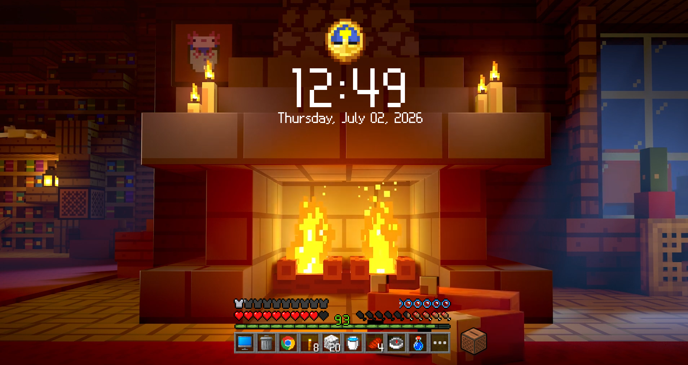

# DMeloper's Block HUD

[English](README.md) | 한국어

  
  
  
  

DMeloper's Block HUD는 Minecraft 스타일의 인벤토리와 핫바 UI에서 영감을 받은 비공식 Windows용 Rainmeter 스킨입니다.

이 스킨은 블록형 HUD 구성을 선호하는 사용자를 위해 제작되었으며, 핫바, 인벤토리 패널, 시스템 인디케이터, 시계, 설정 창, 사용자 슬롯 및 이미지 편집을 위한 내장 에디터를 포함합니다.

Rainmeter나 스킨 설치에 익숙하지 않은 사용자는 아래 스킨 노션 페이지에서 자세한 설치 및 사용 방법을 확인할 수 있습니다.

[스킨 노션 페이지](https://www.notion.so/DMeloper-s-Block-HUD-2f12dc0bb4ae803a8643f3eb1601ed5d?pvs=21)

## 주요 기능

- Minecraft 스타일의 핫바 및 인벤토리 레이아웃
- 프로그램, 폴더, 파일, 웹 링크를 연결할 수 있는 클릭형 아이템 슬롯
- 아이템 이름, 실행 대상, 이미지, 개수, 이미지 정렬을 조정할 수 있는 내장 스킨 에디터
- 로컬 음악 재생과 외부 음악 앱 연동을 지원하는 주크박스
- 스킨 이미지를 첨부해 적용할 수 있는 스킨 첨부 기능
- 히로빈 콘텐츠
- CPU, RAM, GPU, VRAM 등 시스템 값을 표시하는 인디케이터
- 글자 크기, 색상, 굵기, 테두리, 그림자 세로 위치·색상·흐림·투명도와 12/24시간 표시를 조정할 수 있는 시계 스킨
- Hotbar, 인디케이터, Clock, ClockSprite를 모니터별로 선택해 복제하고 독립적으로 배치·드래그·가장자리 스냅할 수 있는 기능
- Editor, Hotbar, Inventory의 GIF 아이템 애니메이션과, 준비에 실패하면 정적 표시를 유지하는 마우스 방향 추적 Inventory 플레이어
- 실행 취소, 다시 실행, 새로고침, 초기화, 위치, 테마, 폰트, 시작 옵션을 포함한 설정 창
- HUD 수동 드래그 및 스냅 배치 옵션
- 구버전 스킨 데이터 가져오기 지원
- 릴리즈 노트, 24시간 알림 미루기, SHA-256 검증을 거치는 스킨 내 최신 버전 업데이트를 제공하는 가벼운 업데이트 알림
- 다른 설치본은 유지하면서 같은 버전을 다시 내려받는 확인형 현재 스킨 초기화
- Korea / Global 두 가지 공개 패키지

## 다운로드

최신 버전은 GitHub Releases 페이지에서 내려받을 수 있습니다.

https://github.com/d-meloper/dmelopers-block-hud/releases/latest

다운로드하기 전에 release notes를 확인해 주세요. release notes에는 사용할 수 있는 variant asset과 공개된 asset의 SHA256 checksum이 적혀 있습니다. Korea 또는 Global variant가 일시적으로 제공되지 않을 수 있으며, 이 경우 해당 asset은 checksum 줄 없이 unavailable로 표시됩니다.

GitHub에서 직접 설치하려는 경우에는 반드시 `.rmskin` 파일을 사용하세요. `.zip` 파일은 스킨 내부의 버전 관리자 및 업데이터에서 사용하는 패키지이며, 일반적인 수동 설치용으로는 권장하지 않습니다.

한국어 사용자는 `DMelopers-Block-HUD_Korea.rmskin`을 내려받는 것을 권장합니다. 영어 또는 글로벌 환경 사용자는 `DMelopers-Block-HUD_Global.rmskin`을 사용하세요.

`.rmskin` 패키지는 `DMeloper's Block HUD Korea v<version>` 및 `DMeloper's Block HUD Global v<version>`처럼 variant와 버전이 포함된 별도 스킨 폴더에 설치됩니다. 두 설치본은 나란히 공존할 수 있으며, 관리하거나 삭제할 때 해당 폴더를 선택하세요.

업데이트는 가능하면 스킨에 포함된 `Skin manager`를 사용하세요. `Skin manager`는 과거 릴리즈 목록 전체를 불러오지 않고 현재 설치된 variant의 검증된 최신 릴리즈 정보를 확인해 맞는 ZIP 패키지를 적용합니다. 호환되는 설정, 아이템, 사용자 이미지와 로컬 음원은 새 설치본으로 이어지며, 일부 아이템 이미지 필드를 사용할 수 없는 경우에는 해당 필드만 비우기 전에 확인을 요청합니다. GitHub에서 수동으로 다시 설치하려는 경우에는 `.rmskin` 파일을 사용하세요.

더 안전한 Mouse.dll 설치가 필요하면 업데이트 중 `마우스 플러그인 업데이트` 안내가 표시되고 Rainmeter가 자동으로 재시작될 수 있습니다. 완료될 때까지 기다리세요. 안내가 반복되거나 업데이트가 되돌려지면 DLL을 직접 교체하지 말고 로그를 확인한 뒤 지원 경로를 이용하세요.

v1.4.1부터 네트워크로 내려받은 updater ZIP은 공개된 SHA-256과 대조하며, 검증된 metadata 또는 다운로드한 파일 내용이 일치하지 않으면 압축 해제 전에 거부합니다. 검증 범위와 한계는 [보안 정책](SECURITY.ko-KR.md)을 확인하세요.

## 요구 사항

- Windows 7 이상
- https://www.rainmeter.net/ 에서 설치한 Rainmeter
- 권장 환경: Windows 11, 1920x1080 해상도, 디스플레이 배율 100%
- 더 부드러운 렌더링을 위해 Rainmeter 하드웨어 가속 사용 권장

이 스킨은 macOS, Linux, Windows 7 미만 환경을 지원하지 않습니다.

## 기본 사용 방법

설치, 사용자 지정, 기본 사용 방법은 스킨 노션 페이지에서 확인할 수 있습니다.

[스킨 노션 페이지](https://www.notion.so/DMeloper-s-Block-HUD-2f12dc0bb4ae803a8643f3eb1601ed5d?pvs=21)

## 로컬라이제이션

v1.4.3 기준, Block HUD는 한국어, 영어, 러시아어, 일본어, 중국어를 포함한 총 42개 언어를 지원합니다.

스킨 번역을 돕거나 기존 번역을 개선하고 싶다면 DMeloper's Block HUD Translation Hub를 이용해 주세요. 코드나 Rainmeter 파일을 직접 수정할 필요는 없으며, 번역 작업은 언어별 Google Sheet에서 공동으로 진행됩니다.

[DMeloper's Block HUD Translation Hub](https://www.notion.so/aismash/DMeloper-s-Block-HUD-Translation-Hub-3982dc0bb4ae80ebb693ecd08d9d498a?source=copy_link)

## 문제 해결

먼저 다음 항목을 확인해 보세요.

- Rainmeter 새로고침
- 설정 창 다시 열기
- `Hide element` 또는 인벤토리 버튼 숨김 옵션 활성화 여부 확인
- `Allow drag`를 켠 뒤 해당 스킨 위치 조정
- 특정 요소만 위치가 어긋난 경우 `Reset skin position only` 사용
- 전체 레이아웃이 크게 어긋난 경우에만 `Reset all skin positions` 사용
- 가져오기, 업데이트, helper 동작이 실패한 경우 설정 또는 디버그 영역에서 로그 폴더 열기

스킨 기본값 복구, 스킨 삭제, Rainmeter 삭제 방법은 스킨 노션 페이지에서 확인할 수 있습니다.

[복구 및 삭제 안내](https://www.notion.so/DMeloper-s-Block-HUD-2f12dc0bb4ae803a8643f3eb1601ed5d?pvs=21)

## 문의 / 버그 제보 / 기여

문의나 버그 제보 전에 아래 문서를 먼저 확인해 주세요.

- [자주 묻는 질문](https://www.notion.so/3512dc0bb4ae8097b5b8c17ce5b8aa13?pvs=21)
- [알려진 버그](https://www.notion.so/3522dc0bb4ae80bfb614fec111a930b5?pvs=21)
- [스킨 개선 작업 현황](https://www.notion.so/35c2dc0bb4ae80c7a033e942069d76c3?pvs=21)

버그 제보, 기능 제안, 사용 문의는 아래 설문지를 통해 보낼 수 있습니다.

[DMeloper's Block HUD 설문지](https://www.notion.so/2f72dc0bb4ae809ebddfed8a2c16978a?pvs=21)

GitHub 기여 proposal을 보내려면 Pull Request를 열기 전에 기여 안내를 먼저 읽어 주세요.

[기여 안내](CONTRIBUTING.ko-KR.md)

이 공개 저장소는 공개 릴리즈를 위한 distribution 및 review surface입니다. 커뮤니티 Pull Request는 proposal로 검토되며, 채택된 변경은 maintainer 검증 후 release approval Pull Request를 통해 공개 릴리즈에 포함될 수 있습니다.

버그를 제보할 때는 가능한 한 다음 정보를 함께 포함해 주세요.

- 스킨 버전
- 사용한 패키지: Korea 또는 Global
- 설치 방법: `.rmskin`, `.zip`, 업데이터
- Windows 버전
- Rainmeter 버전
- 재현 단계
- 기대한 결과와 실제 결과
- 시각적 문제인 경우 스크린샷 또는 화면 녹화
- 관련 로그

## 지원

- 버그 및 기능 요청: GitHub Issues 사용
- 코드, 문서, 번역 proposal: Pull Request를 열기 전에 `CONTRIBUTING.ko-KR.md` 확인
- 보안 제보: `SECURITY.md` 절차를 따르고 공개 이슈로 올리지 않기
- 설치 및 사용 문의: 먼저 `SUPPORT.md` 확인

## 크레딧

- 스킨 제작자: [DMeloper](https://litt.ly/dmeloper)
- Rainmeter: https://github.com/rainmeter/rainmeter, https://www.rainmeter.net/
- Mouse plugin: [Mouse.dll](https://github.com/NighthawkSLO/Mouse.dll), [@NighthawkSLO](https://github.com/NighthawkSLO), [@TheAzack9](https://github.com/TheAzack9)
- WebNowPlaying: [WebNowPlaying-Rainmeter](https://github.com/keifufu/WebNowPlaying-Rainmeter) - [@tjhrulz](https://github.com/tjhrulz), [@keifufu](https://github.com/keifufu)
- Galmuri font: https://quiple.dev/galmuri, Lee Minseo

## 라이선스 및 권리 고지

작성자가 만든 원본 코드와 원본 리소스는 MIT License로 배포됩니다. 자세한 내용은 `LICENSE`를 확인하세요.

서드파티 크레딧과 고지는 `THIRD_PARTY_NOTICES.md`에 정리되어 있습니다.

이 스킨은 Mojang Studios 또는 Microsoft와 아무 관련이 없으며, 승인 또는 후원을 받지 않았습니다. Minecraft 및 관련 상표, 이름, 저작권은 각 권리자에게 있습니다.
